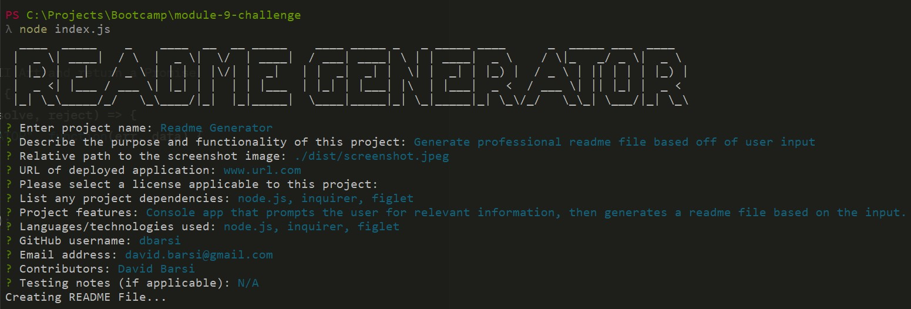

# Readme Generator 
  
  ## Description
  Generate professional readme via user input retrieved from the console
  ## Deployed Application URL
  http://sondavid85.github.io/module-9-challenge
  ## Screenshot
  
  ## Table of Contents
  * [Features](#features)
  * [Languages & Dependencies](#languagesanddependencies)
  * [Usage](#Usage)
  * [Contributors](#contributors)
  * [Testing](#testing)
  * [Questions](#questions)
  ## Features
  Generates professional readme file with links, screenshot and url to deployed app
  ## Languages & Dependencies
  N/A
  ## Usage:
  HTML, JavaScript, CSS
  ## Contributors
  N/A
  ## Testing
  N/A
  ## Questions
  Please send your questions [here](mailto:sondavid85@yahoo.com?subject=[GitHub]%20Dev%20Connect) or visit [github/sondavid85](https://github.com/sondavid85).
  